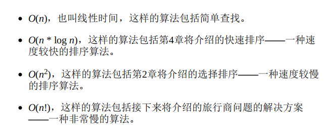
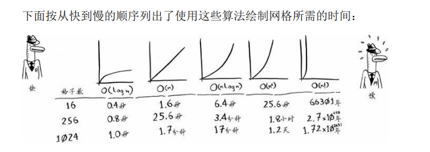

# 算法图解

## 一. 二分算法

1. 概念：取一半在查找，直到找到为止。
2. 代码及解析
[二分算法](code/二分算法.py)

## 二.大O表示法

1. 概念：算法运行时间的增速，操作数的多少
2. 各种类型的解释

  
3. 各种类型的图解

## 三.选择排序

### 3.1 基本概念

1. 数组和链表  
    **数组(Array)**:有序的元素序列，同类数据元素的集合，紧靠在一起。
        示例：有四个待办事项，内存一行四个，最后一个被占用，只能换一行内存  
    **链表(linked list)**：非连续，非顺序的存储结构，(我们分开坐)，给出地址号，就可以移动，根本不需要移动元素。  
        示例：若电影院没有6人一排的座位了，那就分开来做，(这个原理)，前提有足够的空间  
2. 优势  
    **链表**：  
        优势：方便插入和删除元素  
        劣势：不能跳跃读取数据  
    **数组**：  
        优势：随机查询  
        劣势：数组是紧紧相依在一起的，插入不是很适用  
3. 练习  
    经常有用户在Facebook注册，假设你已经决定使用数组来存储用户名，在插入方面数组有何缺点？具体地说，在数组中添加新用户将出现什么情况？  
    答：数组的插入速度很慢。另外，要使用二分查找算法来查找用户名，数组必须是有序的。假设有一个名为AditB的用户在Facebook注册，其用户名将插入到数组末尾，因此每次插入用户名后，你都必须对数组进行排序。  

### 3.2 代码

[选择排序](code/选择排序.py)
